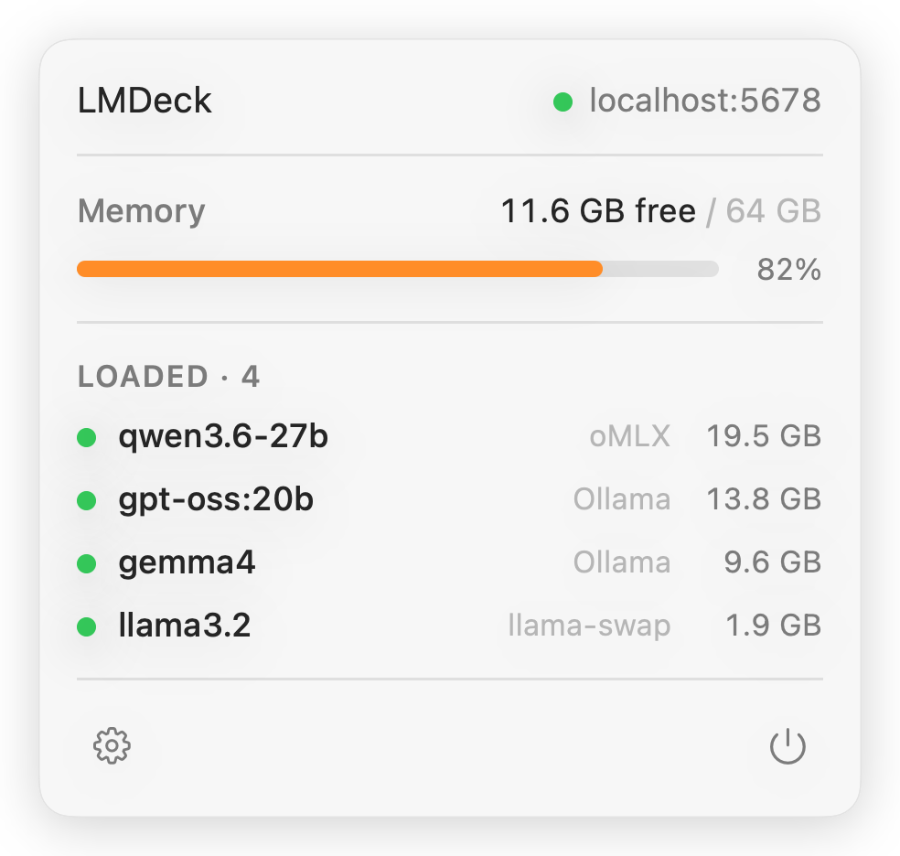
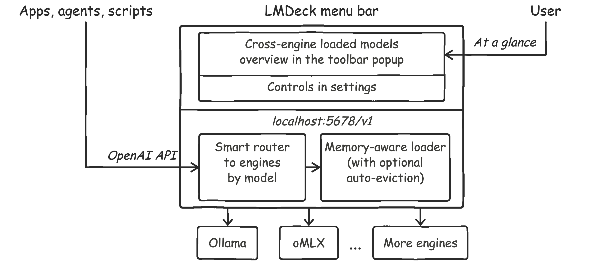
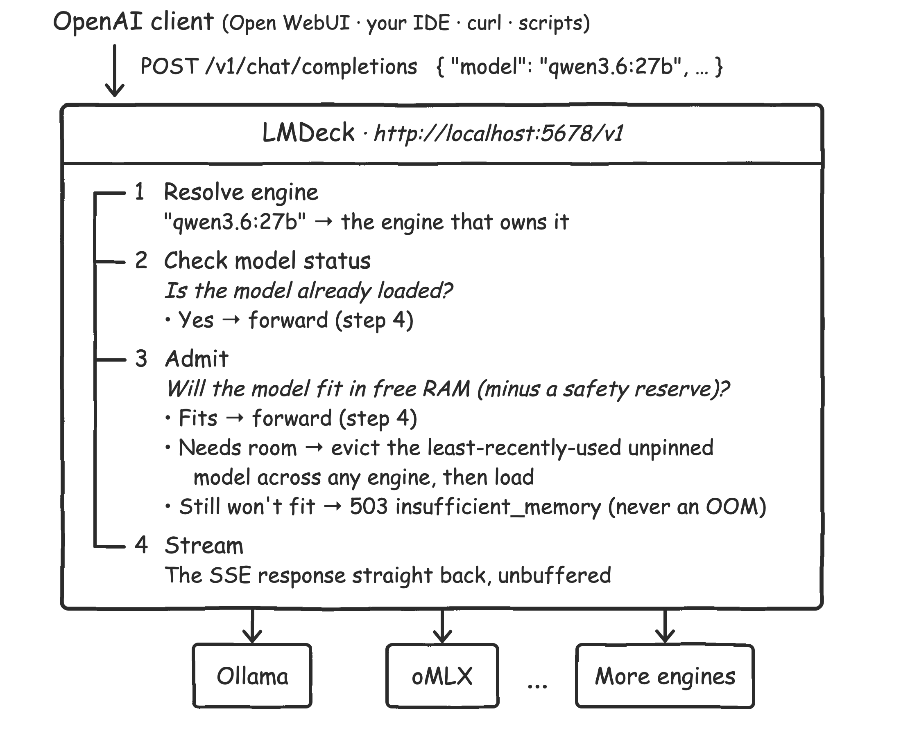

<div align="center">

# LMDeck

One OpenAI endpoint for local LLM engines. Cross-engine routing and memory management — request admission and model auto-eviction.

[](https://github.com/enclavum/lmdeck/releases/latest)
[](https://github.com/enclavum/lmdeck/actions/workflows/ci.yml)




</div>

---

## What is LMDeck?

Running local models across several engines leaves everything scattered: it's hard to see everything loaded on the
machine, switch apps and agents between models from different engines, or load and unload models across all of them.
And since the engines share one memory pool and not all of them are memory-aware, triggering a model load can lead to
OOM.

LMDeck brings all your local models together — managed centrally, combined behind a single endpoint for your tools, and
surfaced in one menu-bar view.

<p align="center">
  
</p>

Point your clients at `http://localhost:5678/v1` and let them send requests to the same models they would send to the
engines directly. LMDeck figures out which engine runs the requested model, routes the request there, and streams the
response back. If the requested model isn't loaded yet, LMDeck can evict unpinned models to let the engine load the
requested model. Meanwhile, the menu-bar popup shows all loaded models and your free memory at a glance.

---

## Install

> **Requirements:** macOS 15 (Sequoia) or later.

**Homebrew**

```bash
brew install --cask lmdeck
```

**Direct download**

Grab `LMDeck.dmg` from the [latest release](https://github.com/enclavum/lmdeck/releases/latest), open it, and drag
LMDeck to Applications.

---

## Quickstart

Launch the app, click the toolbar icon, open **Settings → Engines** and enable the engines you want to use. Click the
**Auto configure** button — it will automatically retrieve engine settings (on a best-effort basis), so you probably
don't need to configure anything manually. The status dot next to each engine turns green when it's reachable and its
API key is correct.

Then click the menu-bar icon and confirm your loaded models appear. On the Models page, you may pin the models you'd
like to keep hot so they're never auto-evicted (or turn off auto-eviction entirely on the Server page).

Finally, point your agents or apps at the unified endpoint.

---

## Features

### Near zero setup

Nothing to wire up by hand. On first launch LMDeck probes for the engines you're running and switches
the ones it finds on. From there, the **Auto configure** button (Settings → Engines) reads each
engine's port and API key from what's already on your machine — its own settings file, an environment
variable, or its launch arguments — and fills the fields in for you. It's read-only, runs only when you
click it, never shells out to a CLI, and sends nothing off your Mac; the [Auto-configure](#auto-configure)
table lists exactly what's read per engine. Sensible defaults (standard ports, auto-eviction on) cover
the rest, so a fresh install usually just works.

### One endpoint, multiple engines

A single OpenAI-compatible base URL (`http://localhost:5678/v1`) fronts **Ollama, oMLX, LM Studio, and llama-swap**
at once. `GET /v1/models` returns the union of everything they expose; `POST /v1/chat/completions` (and any other
`/v1/*` request with a top-level `model` in its JSON body) is forwarded to whichever engine owns that model and
**streamed back unbuffered**.
Switch engines, add a model, change a port — your client URL never changes. The engine layer is pluggable.

### A native Mac app — no terminal, config files or daemons

LMDeck lives in your menu bar. Click the icon for a live read on your machine: a free-RAM gauge and every model
currently resident across all your engines.

The Settings window gives every engine and every model a real UI: per-model **Load / Unload** buttons (greyed out
when a model won't fit in free memory *right now*), pin toggles, a persisted activity log, and all your ports and keys
saved in Keychain — no YAML to hand-edit, nothing to run from a shell.

### Memory-aware loading and auto-eviction

LMDeck predicts each model's RAM footprint (weights + KV cache + overhead) and treats your free memory as a shared
budget across all your engines. Before any model loads — whether triggered by an API request or a click — it checks
whether it actually fits.

- **Auto-evict (on by default).** A request needs a 32 GB model but only 12 GB is free? LMDeck unloads the
  **least-recently-used, unpinned** model — from *any* engine — until the newcomer fits, then serves the request.
- **Pinning.** Pin the models you always want hot. They're never auto-evicted by LMDeck — and on Ollama,
  LMDeck keeps them resident in the engine too (no idle timeout); on other engines a pin is best-effort. If
  nothing else can be freed, the request is refused with a clean `insufficient_memory` error instead of
  thrashing your machine.
- **No surprises.** Turn auto-evict off and LMDeck simply refuses anything that won't fit as-is.

The estimate is sharpest for Ollama (it reads real model architecture for a KV-cache-accurate number) and a solid
approximation everywhere else. A 2 GB headroom reserve protects macOS and your other apps.

### Automatic model discovery

Nothing to register. LMDeck continuously polls each engine and surfaces every model it finds — name, loaded state,
on-disk size, context window — at the endpoint and in the UI. Pull a new model in Ollama or add one in LM Studio
and it simply appears on the next refresh. On **first launch** it auto-detects which engines you actually run
and enables just those, so there's no setup to do.

### Smart routing

| You send `"model": …`                            | LMDeck routes to |
|--------------------------------------------------| --- |
| `qwen3.6:27b` *(bare name)*                      | the highest-priority engine that has it |
| `ollama/qwen3.6:27b` *(qualified)*               | **exactly** Ollama — `404` if Ollama doesn't have it (an explicit pick is never silently rerouted) |
| `lmstudio-community/Qwen3.6-27B` *(HF-style id)* | treated as a bare name — the slash prefix isn't an engine token |

When the same model name exists in two engines, a bare request resolves by a fixed priority: **Ollama → oMLX →
LM Studio → llama-swap**. Want the other one? Qualify it with `<engine>/<model>`.

### A native API for programmatic control

Beyond the OpenAI surface, LMDeck exposes a richer catalog and explicit model control — perfect for scripts,
dashboards, and your own tooling:

- `GET /api/v1/models` — every model with `loaded`, on-disk `size`, `context_length`, `estimated_size`, and a
  `can_load` flag that answers "would this fit in memory right now?"
- `POST /api/v1/models/load` / `unload` — load or unload by id, memory-gated, idempotent, returns the updated row.

### Secure by default

Local-only (`127.0.0.1`) out of the box. Optionally set an **API key** to lock the endpoint. Bind to your LAN
(`0.0.0.0`) and LMDeck hardens automatically: model load/unload is blocked for anonymous peers until you set a key,
with a concurrency cap and a request-size limit so no one can exhaust your RAM from across the network. Keys live in
the macOS data-protection Keychain in signed builds.

---

## Request flow

On a unified-memory Mac, model weights live in the same RAM as everything else, and each engine manages only its own
footprint. LMDeck is the one process that tracks what's resident across all of them and gates every load against your
real, free memory.

<p align="center">
  
</p>

Concretely:

- **Pre-flight admission on every load.** Whether you call `/api/v1/models/load` or just send a chat
  request that triggers a just-in-time load, LMDeck first estimates the model's footprint (weights + KV
  cache at the context it will actually load + overhead) and checks it against free RAM.
- **Cross-engine LRU eviction (the part no single engine can do).** If it doesn't fit, LMDeck silently
  unloads the **least-recently-used unpinned** model — *across any engine* — until there's room. An oMLX
  model can make way for an Ollama one. This is on by default (**Auto-evict**, Settings → Server).
- **A clean refusal instead of a crash.** If it still won't fit after freeing everything it's allowed to,
  the request fails with `503 insufficient_memory` and a human-readable "needs ~X GB, only Y GB free" —
  not a frozen Mac.
- **Pinning.** Mark the models you always want hot (Settings → Models). Pinned models are never evicted by
  LMDeck — and on Ollama, LMDeck keeps them resident in the engine (no idle timeout); on other engines a pin
  is best-effort. Turn Auto-evict off entirely to make LMDeck refuse rather than evict.
- **Safe under concurrency.** Two first-loads racing through admission can't both "win" and together
  overcommit RAM — in-flight loads reserve their footprint until they're resident.

The explicit load endpoint is deliberately stricter than the proxy path: it **never** auto-evicts, returns
`409` if a model won't fit, and only overrides with an explicit `"force": true`.

---

## Supported engines

| Engine         | Lists models | Load / unload | Memory estimate |
|----------------|:---:|:---:|---|
| **Ollama**     | ✓ | ✓ | **Best** — exact KV cache from model architecture |
| **oMLX**       | ✓ | ✓ | Good — engine-reported footprint |
| **LM Studio**  | ✓ | ✓ | Approx — size-scaled KV estimate |
| **llama-swap** | ✓ | ✓ | Approx — known only while a model is running |

Support for more engines is planned for future releases.

Each engine can be enabled/disabled independently, and its port and API key configured, in **Settings →
Engines** — where a status dot tells you at a glance whether it's reachable, unreachable, or rejecting your key.

### Auto-configure

Most engines already record their own port (and sometimes key), so LMDeck can fill the Engines
settings in for you. After clicking the **Settings → Engines → Auto configure** button, LMDeck reads each engine's port and
API key from sources already on your machine and writes them in.

| Engine | Port | API key | Read from |
|---|:---:|:---:|---|
| **oMLX** | ✓ | ✓ | `~/.omlx/settings.json` |
| **LM Studio** | ✓ | — | `~/.lmstudio/.internal/http-server-config.json` |
| **Ollama** | ✓ | — | the `OLLAMA_HOST` environment variable, else the default port |
| **llama-swap** | ✓ | ✓ | port from `--listen` (process list); key from `--config` YAML |

Anything LMDeck can't detect is left untouched, so you can still set it by hand.

---

## API reference

Everything is served from `http://<host>:<port>` (default `http://127.0.0.1:5678`).

| Method | Path | What it does |
| --- | --- | --- |
| `GET`  | `/v1/models` | OpenAI-compatible list. Ids are qualified `engine/model`; `owned_by` names the engine. |
| `POST` | `/v1/**` | Forwards any OpenAI-style call (chat, completions, embeddings, …) to the engine that owns the `model` in the body. Streams the response. |
| `GET`  | `/api/v1/models` | Rich catalog: `id`, `model`, `engine`, `loaded`, `size`, `context_length`, `estimated_size`, `can_load`. |
| `POST` | `/api/v1/models/load` | Body `{ "model": "<id>", "force": false }`. Memory-gated unless `force`. Idempotent; returns the updated row. |
| `POST` | `/api/v1/models/unload` | Body `{ "model": "<id>" }`. Never gated; idempotent. |

**Auth.** Send `Authorization: Bearer <key>` when you've set an endpoint key in Settings → Server. Upstream
engine keys are handled by LMDeck transparently — your inbound key is never forwarded.

**Insufficient memory.** When a model's predicted footprint won't fit in free RAM, the two load paths return
different status codes (both carry `error.type` = `insufficient_memory`):

| Path | HTTP status | Error `type` |
| --- | --- | --- |
| Admission — proxy chat path (`POST /v1/**`, just-in-time load) | `503` Service Unavailable | `insufficient_memory` |
| Direct load (`POST /api/v1/models/load`) | `409` Conflict | `insufficient_memory` |

The proxy path returns `503` because it first tries to evict the least-recently-used unpinned model and only
refuses if it still won't fit; the explicit load endpoint returns `409` because it never auto-evicts unless you
pass `"force": true`.

---

## Contributing

Issues and PRs are welcome. CI runs the build and the Swift unit suite on every push and PR — please keep it green
and add tests for new pure logic. See [CONTRIBUTING.md](CONTRIBUTING.md) and the issue templates to get started.

## License

Apache License 2.0 — see [LICENSE](LICENSE). Copyright © 2026 The LMDeck Authors.
